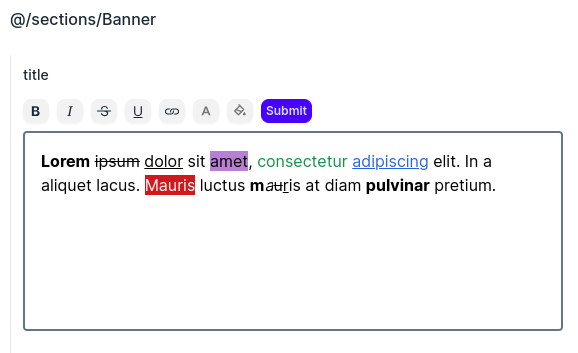
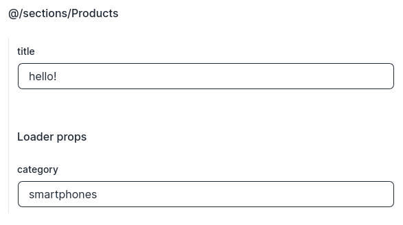

# kiwi-nextjs

This project contains a CLI with two actions:

- `kiwi init`: configures folders and behaviors to integrate with admin app
- `kiwi manifest`: generates a manifest file which contains all sections and loaders created locally in your project which will be displayed through the "CatchAll" component and used by **kiwi admin** to display your sections and loaders with their props.

## Configuration

You should configure this lib by creating the following env vars:

- NEXT_PUBLIC_KIWI_SUPABASE_URL
- NEXT_PUBLIC_KIWI_SUPABASE_ANON_KEY
- NEXT_PUBLIC_ADMIN_URL

## Sections

Kiwi admin uses your manifest sections (sections folder) to build pages.

#### generated manifest example

```ts
...
import * as $0 from '@/sections/Banner';
...

const manifest = {
  sections: {
    '@/sections/Banner': {
      module: $0,
      schema: {
        component: {
          properties: [
            { name: 'title', type: 'RichText' },
            { name: 'text', type: 'RichText' },
            { name: 'cta', type: 'string' },
            { name: 'src', type: 'string', description: 'image url' },
          ],
          required: ['title', 'text', 'cta', 'src'],
          type: 'object',
        },
      },
    },
    ...
  }
}
```

When we run `npx kiwi manifest` our manifest is generated using this pattern, we have the exported module which contains a "default" exported (the component properly) and a loader (optional, we will write about it forward).

Note that we have primitive types and also "custom types" such as RichText, it means that we have some special behaviors in **kiwi app** when you using this type. We also have descriptions!



<br />

#### Banner section example

```ts
export interface BannerProps {
  title: RichText;
  text: RichText;
  cta: string;
  /** @description image url */
  src: string;
}

export default function Banner(props: BannerProps) {
  return ...
}
```

> **IMPORTANT**: You should export your props interface!

## Loaders

```ts
// Component
interface ProductsLoader {
  amount: number;
  products: {
    id: number;
    title: string;
    category: string;
  }[];
}

export interface ProductsProps {
  loader: ProductsLoader;
  title: string;
}

export default function Products(props: ProductsProps) {
  return ...;
}

// Loader
export interface ProductsLoaderProps {
  category: string;
}

export async function Loader(
  req: LoaderRequest,
  props: ProductsLoaderProps,
): Promise<ProductsLoader> {
  const request = await fetch(`https://dummyjson.com/products/categories/${props.category}`);
  const { products, total } = await request.json();

  return {
    amount: total,
    products,
  };
}
```

A function called "Loader" must be exported by your section, this function receives two objects:

- LoaderRequest: object containing headers and cookies used for request the page, when using the live editor (**kiwi admin**), this object is empty.
- props: properties used to do some operation that you defined in your loader, this properties are configured in **kiwi admin**

You will receive the "loaded props" in your "loader" prop.
<br />
<br />
<br />


> **IMPORTANT**: The exported loader function **MUST** be called "Loader" and your "receiver" prop **MUST** be called "loader". So that kiwi admin can handle without side effects.
