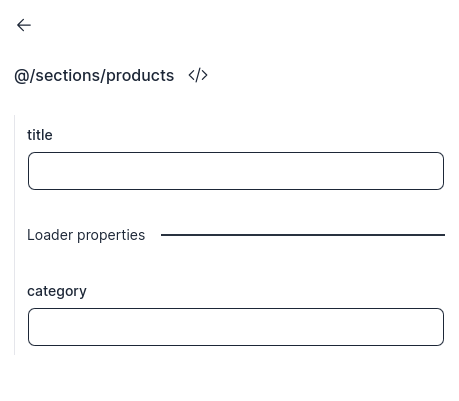

# kiwi-nextjs

This project contains a CLI with three actions:

- `npx kiwi init`: configures folders and behaviors to integrate with admin app
- `npx kiwi manifest`: generates a manifest file which contains all sections and loaders created locally in your project which will be displayed through the "CatchAll" component and used by **[kiwi admin](https://github.com/kiwi-app/kiwi-admin)** to display your sections and loaders with their props.
- `npx kiwi generate`: generates a boilerplate with the selected "section type&
  - _simple_ section that uses "static" props from kiwi admin
  - _loader_ section that also uses props from kiwi admin but also make external request before render.

# [Demo project](https://github.com/kiwi-app/kiwi-template)

# Getting started

Create your [Next](https://nextjs.org/) app

```bash
npx create-next-app@latest
```

Install kiwi lib for nextjs:

```bash
npm install @kiwi-app/kiwi-nextjs
```

Run init for first configuration (also will generate your first empty manifest):

```bash
npx kiwi init
```

Generate your first section (automatically updates your manifest):

```bash
npx kiwi generate
```

Start your project

```bash
npm run dev
```

Open [Kiwi Admin](https://kiwi-admin.vercel.app), link your site and get the API Key:


## Configuration

You should configure this lib by creating the following env vars:

- KIWI_ADMIN_URL (ex: `https://kiwi-admin.vercel.app`)
- KIWI_API_KEY

If you want to remove or change cache time, you can set `KIWI_CACHE_TTL` (in seconds) env var

# About kiwi

## Sections

Kiwi uses your manifest sections (sections folder) to build the pages.

#### generated manifest example

```ts
...
import * as $0 from '@/sections/Banner';
...

const manifest = {
  sections: {
    '@/sections/Banner': {
      module: $0,
      schema: {
        component: {
          properties: [
            { name: 'title', type: 'RichText' },
            { name: 'text', type: 'RichText' },
            { name: 'cta', type: 'string' },
            { name: 'src', type: 'string', description: 'image url' },
          ],
          required: ['title', 'text', 'cta', 'src'],
          type: 'object',
        },
      },
    },
    ...
  }
}
```

When we run `npx kiwi manifest` our manifest is generated using this pattern, we have the exported module which contains a "default" exported (the component properly) and a loader (optional, we will write about it forward).

Note that we have primitive types and also "custom types" such as RichText, it means that we have some special behaviors in **kiwi** when you using this type. We also have descriptions!


<br />

#### Banner section example

```ts
export interface BannerProps {
  title: RichText;
  text: RichText;
  cta: string;
  /** @description image url */
  src: string;
}

export default function Banner(props: BannerProps) {
  return ...
}
```

> **IMPORTANT**: Your props interface should be composed by the component name + "Props" (BannerProps)

> **IMPORTANT**: You must export your section component as default!

> **also IMPORTANT**: You should export your props interface!

## LoaderRequest

Loader request brings to your loader:

- search params used while accessing the page (/home?say=hello)
- url params (generic type, you will see forward)
- headers
- cookies

## Loaders

```ts
// Component
// interface used only for locally type the "loader" response
interface ProductsLoaderResponse {
  amount: number;
  products: {
    id: number;
    title: string;
    description: string;
    price: number;
  }[];
}

export interface ProductsProps {
  loader: ProductsLoaderResponse; // prop fulfilled by the loader
  title: string; // static prop
}

export default function Products(props: ProductsProps) {
  return ...;
}

// Loader
// this interface types the props that will be shown in admin
export interface ProductsLoaderProps {
  category: string;
}

export async function Loader(
  req: LoaderRequest,
  props: ProductsLoaderProps,
): Promise<ProductsLoaderResponse> {
  const request = await fetch(`https://dummyjson.com/products/categories/${props.category}`);
  const { products, total } = await request.json();

  return {
    amount: total,
    products,
  };
}
```

A function called "Loader" must be exported by your section, this function receives two objects:

- LoaderRequest: object containing headers and cookies used for request the page, when using the live editor (**kiwi admin**), this object is empty.
- props: properties used to do some operation that you defined in your loader, this properties are configured in **kiwi admin**

You will receive the "loaded props" in your "loader" prop.

### Placeholder

If you want to show something while the section is mounting, you can export a "Loading" component that will be attached on Suspense fallback while the section finishes the loader request.

```ts
// Component
interface ProductsLoader {...}

export interface ProductsProps {...}

export default function Products(props: ProductsProps) {
  return ...;
}

// Loader
export interface ProductsLoaderProps {...}

export async function Loader(
  req: LoaderRequest,
  props: ProductsLoaderProps,
): Promise<ProductsLoader> {
 ...
}

// Loading
export function Loading() {
  return <p>You will see me while this section is loading</p>
}
```

<br />
<br />



> **IMPORTANT**: The exported loader function **MUST** be called "Loader", your "receiver" prop **MUST** be called "loader" and your loading placeholder **MUST** be called "Loading". So that kiwi can handle without side effects.

## Dynamic pages

You can create dynamic pages and receive the params from "LoaderRequest" object inside your loader.

```ts
// Component
interface Product {
  id: number;
  title: string;
  description: string;
  price: number;
}

export interface ProductProps {
  loader: Product;
}

export default function Product(props: ProductsProps) {
  return ...;
}

// Loader
// interface used only for locally type the "params" object
interface ProductParams {
  id: string;
}

// page: /product/:id
export async function Loader(req: LoaderRequest<ProductParams>): Promise<Product | null> {
  try {
    const request = await fetch(`https://dummyjson.com/products/${req.params!.id}`);
    const product = await request.json();

    return product;
  } catch (e) {
    return null;
  }
}
```

For testing and preview purposes, the admin shows an input for each path param and it will be replaced as loader props while "live editing".
<br />
<br />


